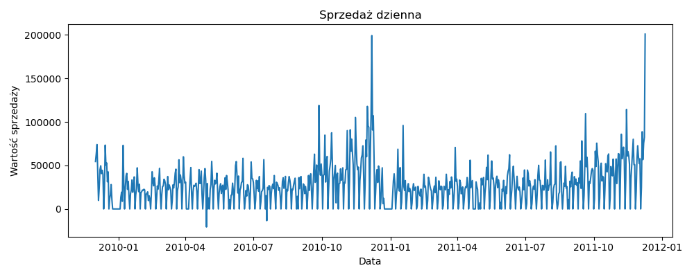
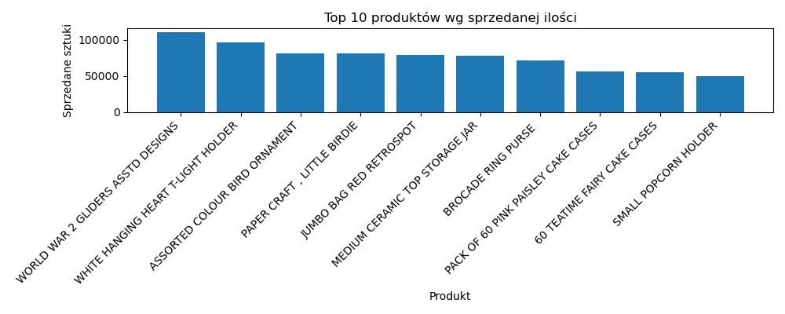
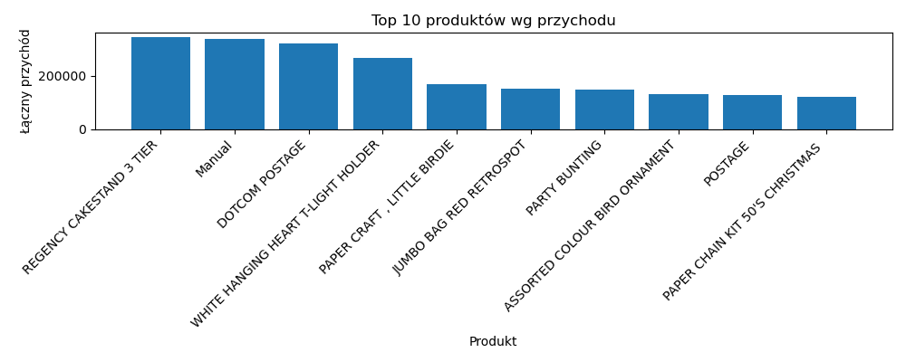

# Analiza danych zakupów online

Niniejszy projekt został przygotowany w ramach przedmiotu **„Wstęp do eksploracji danych”**. 
Jego głównym celem jest przeprowadzenie wszechstronnej analizy eksploracyjnej na danych zawartych w pliku **zakupy-online.xlsx**, dzięki której uzyskamy wgląd w charakterystykę, jakość i ukryte struktury tego zbioru danych.

---


## 1. Zapoznanie się z danymi

Przed eksploracją danych zapoznajemy się z nimi, aby zrozumieć ich strukturę, 
typy zmiennych oraz ogólny kontekst, w jakim zostały zebrane. Umożliwia to wczesne 
wykrycie braków, błędów, wartości odstających oraz niespójności, które mogłyby zakłócić 
dalszą analizę. Dzięki temu możemy ocenić jakość danych i dobrać odpowiednie metody eksploracji,
transformacji i modelowania. Ten etap pozwala również zrozumieć, co reprezentują poszczególne 
kolumny, jakie są ich zależności i jakie pytania można sensownie postawić na ich podstawie.


Zbiór danych pochodzi z rzeczywistego sklepu internetowego i obejmuje szczegółowe informacje o transakcjach sprzedażowych dokonanych na przestrzeni dwóch lat (**2009–2011**). Dane zostały zapisane w dwóch arkuszach Excela i pochodzą z systemu fakturowania.

Każdy wiersz odpowiada **jednej pozycji na fakturze** (czyli pojedynczej linii sprzedażowej), a nie całej transakcji. Struktura danych obejmuje m.in.:

- **Invoice** (*tekst/liczba*) – identyfikator faktury, który może zawierać literę „C” oznaczającą zwrot.
- **StockCode** (*tekst*) – kod magazynowy produktu.
- **Description** (*tekst*) – opis produktu.
- **Quantity** (*liczba całkowita*) – liczba sprzedanych sztuk.
- **InvoiceDate** (*data i czas*) – znacznik czasu transakcji.
- **Price** (*liczba zmiennoprzecinkowa*) – cena jednostkowa produktu.
- **CustomerID** (*liczba całkowita*) – identyfikator klienta.
- **Country** (*tekst*) – kraj klienta.


Zbiór zawiera **dane transakcyjne**, a więc umożliwia zarówno klasyczną eksplorację danych (**opis statystyczny, analiza sezonowości, rozkładów**), jak i **zaawansowane techniki analizy zachowań zakupowych**, takie jak:
- **Analiza koszykowa**,
- **Segmentacja klientów**.


### Podejście i interpretacja wyników
1. Wczytujemy oba arkusze z pliku Excel (`zakupy-online.xlsx`).
2. Łączymy je w jeden DataFrame, by analizować całość.
3. Sprawdzamy liczbę rekordów w każdym arkuszu i liczbę identycznych wierszy w zbiorze.

**Przykładowe wyniki:**  
- Arkusz „Year 2009-2010”: 525 461 wierszy  
- Arkusz „Year 2010-2011”: 541 910 wierszy  
- Duplikaty: 36 rekordów  

Dzięki temu wiemy, że mamy niemal 1 070 000 unikalnych wpisów.

### Fragment kodu
```python
import pandas as pd

arkusze = pd.read_excel('zakupy-online.xlsx', sheet_name=None, engine='openpyxl')
for nazwa, df_sheet in arkusze.items():
    print(f"{nazwa}: {df_sheet.shape[0]} wierszy")

df = pd.concat(arkusze.values(), ignore_index=True)
duplikaty = df[df.duplicated()]
print(f"Liczba duplikatów: {duplikaty.shape[0]}")
```

## 2. Czyszczenie danych

### Cel / pojęcia
Aby zapewnić poprawność analizy, usuwamy ze zbioru danych wszystkie transakcje niezrealizowane – to znaczy:
transakcje oznaczone jako zwroty (posiadające InvoiceNo zaczynające się od litery "C"),
wiersze z ujemną ilością sztuk (Quantity < 0),
transakcje z brakiem identyfikatora klienta (CustomerID jest NaN).

Po takim oczyszczeniu danych możemy zagwarantować, że pozostaną tylko rzeczywiste, opłacone transakcje.


### Fragment kodu
```python
df = df[~df['InvoiceNo'].astype(str).str.startswith('C')]
df = df[df['Quantity'] > 0]
df = df.dropna(subset=['CustomerID'])

print(f"Liczba wierszy po oczyszczeniu: {df.shape[0]}")
```

## 3. Statystyczny opis danych

Na tym etapie dokonujemy statystycznego opisu danych – opowiadamy je w liczbach. Interesują nas następujące aspekty:

-  **Zakres dat**, z którego pochodzą dane
-  **Liczba unikalnych krajów**
-  **Liczba unikalnych faktur** (`InvoiceNo`)
-  **Liczba klientów** (`CustomerID`)
-  **Liczba różnych produktów** (`Description`)
-  **Zmienność w czasie** liczby transakcji oraz wartości sprzedaży
-  **Najpopularniejsze produkty** (według liczby sprzedanych sztuk)
-  **Najbardziej dochodowe produkty** (według łącznej wartości sprzedaży)

### Fragment kodu
```python
print(f"Zakres dat: {df['InvoiceDate'].min()} → {df['InvoiceDate'].max()}")

kraje = df['Country'].unique()
print(f"Liczba krajów i wybrane regiony: {len(kraje)}")
print(f"Lista krajów i wybrane regiony: {kraje}")

print(f"Liczba unikalnych produktów: {df['Description'].nunique()}")
print(f"Liczba unikalnych faktur: {df['InvoiceNo'].nunique()}")
print(f"Liczba unikalnych klientów: {df['CustomerID'].nunique()}")

df['TotalPrice'] = df['Quantity'] * df['UnitPrice']
dzienna = df.groupby('InvoiceDate').agg({'InvoiceNo': 'count', 'TotalPrice': 'sum'})
dzienna.rename(columns={'InvoiceNo': 'LiczbaTransakcji', 'TotalPrice': 'Sprzedaz'}, inplace=True)
print(dzienna.head())

najczestsze = df.groupby('Description')['Quantity'].sum().sort_values(ascending=False).head(10)
print(najczestsze)

dochody = df.groupby('Description')['TotalPrice'].sum().sort_values(ascending=False).head(10)
print(dochody)

```

## 4. Analiza koszykowa

Celem analizy koszykowej jest wykrycie, które produkty są często kupowane razem.

### Podejście
- Agregujemy dane transakcji na poziomie faktur (`InvoiceNo`), tworząc reprezentację w formacie one-hot.
- Korzystamy z algorytmu **Apriori**, aby znaleźć **zbiory częste** – czyli zestawy produktów, które występują wspólnie z częstotliwością większą niż `min_support`.
- Dla tych zbiorów wyznaczamy **reguły asocjacyjne** – zależności między produktami, które mają wysoką pewność (`confidence`) i współczynnik `lift`.

### Parametry
- `min_support`: wyliczany jako próg odpowiadający 20% najczęstszych produktów.
- `min_confidence`: `0.7`

W analizie korzystamy z **mlxtend**.

### Fragment kodu
```python
from mlxtend.frequent_patterns import apriori, association_rules
from mlxtend.preprocessing import TransactionEncoder

koszyki = df.groupby('InvoiceNo')['Description'].apply(list).tolist()

encoder = TransactionEncoder()
koszyki_encoded = encoder.fit_transform(koszyki)
df_koszyki = pd.DataFrame(koszyki_encoded, columns=encoder.columns_)

zbiory = apriori(df_koszyki, min_support=0.0124, use_colnames=True)

reguly = association_rules(zbiory, metric="confidence", min_threshold=0.7)
print(reguly.head())
```

# 5. Wyniki analizy i wnioski

## 5.1 Opis statystyczny zbioru danych

Po wstępnym połączeniu danych z obu arkuszy uzyskaliśmy zbiór o ponad 1 milionie rekordów, z czego 34 335 to duplikaty. 
Po ich usunięciu oraz odfiltrowaniu transakcji niezrealizowanych (zwrotów i błędnych wpisów) otrzymaliśmy spójny i czysty zbiór transakcji.

Dane obejmują okres od 1 grudnia 2009 do 9 grudnia 2011 i 
pochodzą od klientów z 43 regionów (przynajmniej 36 krajów),
co świadczy o szerokim zasięgu działalności firmy.

### Wnioski dotyczące sprzedaży:

Zmienność dzienna sprzedaży wskazuje na wyraźne sezonowe wahania. 
Najwyższe wartości osiągane są w miesiącach przedświątecznych.

Najpopularniejszym produktem według liczby sprzedanych sztuk był **WORLD WAR 2 GLIDERS ASSTD DESIGNS**, 
natomiast największy przychód przyniósł **REGENCY CAKESTAND 3 TIER**.

Najlepiej widoczne w [wizualizacji](#6.1-Wizualizacja-danych). 


## 5.2 Analiza koszykowa

Celem tej analizy było odkrycie produktów często kupowanych razem. Zastosowano algorytm **Apriori**, a minimalne wsparcie (`support`) 
ustalono na poziomie **3.9%** – odpowiadające **20%** najczęściej występujących produktów.

### Wyniki
- Wygenerowano **zbiory częste**, z których najczęściej występującym był:  
  **PAPER CHAIN KIT 50'S CHRISTMAS** (*wsparcie ≈ 24,7%*).
  
- Dla tych zbiorów wyznaczono **reguły asocjacyjne** z minimalną ufnością (`confidence`) **0.7**.  
  **Przykładowe silne reguły**:
  
  Jeśli klient kupuje **JUMBO STORAGE BAG SUKI** oraz **RETRO SPOT TEA SET CERAMIC 11 PC**,  
  to z pewnością **1.0** dokupi także **CHARLOTTE BAG , SUKI DESIGN**.

### Interpretacja
Takie reguły można wykorzystać w **systemach rekomendacyjnych** – np. do proponowania produktów uzupełniających w sklepie internetowym.

Obecność silnych powiązań między niektórymi produktami wskazuje na **istnienie zestawów**, które konsumenci intuicyjnie kompletują.


# 6. Wizualizacja danych

### Dzienna sprzedaż

Wykres przedstawia całkowitą wartość sprzedaży agregowaną dziennie w badanym okresie od grudnia 2009 do grudnia 2011. 
Zaobserwować można wyraźne fluktuacje sezonowe, z kilkoma wyraźnymi pikami, przypadającymi szczególnie na ostatni kwartał roku. 
Może to świadczyć o nasileniu aktywności zakupowej w okresach przedświątecznych – typowych dla rynków konsumenckich.
Takie dane są szczególnie użyteczne w prognozowaniu popytu, optymalizacji stanów magazynowych oraz planowaniu działań marketingowych w najbardziej dochodowych okresach. 
Obecność dni o niskiej sprzedaży również może być sygnałem do analizy przerw w funkcjonowaniu sklepu lub okresów mniejszego zainteresowania ofertą.



### Top 10 produktów wg liczby sprzedanych sztuk

Na wykresie przedstawiono dziesięć produktów, które osiągnęły najwyższą liczbę sprzedanych sztuk. 
Zdecydowaną większość stanowią produkty niewielkie, niskokosztowe i dekoracyjne, takie jak ozdoby świąteczne, foremki do ciast czy zawieszki.
Może to wskazywać na preferencje klientów względem tanich, impulsywnych zakupów, szczególnie w okresach przygotowań do świąt czy uroczystości. 
Produkty te charakteryzują się często niższą ceną jednostkową, lecz ich wysoka rotacja sprawia, że mogą generować znaczny ruch w sklepie i pełnić funkcję tzw. produktów „przyciągających” (loss-leaders). 
Dla działów handlowych i marketingowych, taka analiza może być podstawą do tworzenia promocji pakietowych oraz lepszego rozmieszczenia produktów w sklepie internetowym (np. cross-selling).



### Top 10 produktów wg przychodu

Produkty przynoszące najwyższy przychód nie zawsze są tymi najczęściej kupowanymi.
Na czele znajduje się **REGENCY CAKESTAND 3 TIER**, mimo że nie należy on do najczęściej wybieranych produktów pod względem ilości.
Sugeruje to, że jego jednostkowa cena jest znacznie wyższa, co czyni go produktem o wysokiej wartości strategicznej. 
Takie towary generują duży przychód przy relatywnie niewielkiej liczbie transakcji, co może być istotne w planowaniu marż oraz kampanii marketingowych.




# Wykorzystane biblioteki i funkcje

- **mlxtend**: Biblioteka do implementacji różnych algorytmów uczenia maszynowego i narzędzi,
  w tym algorytmu **Apriori** i reguł asocjacyjnych. Umożliwia łatwe kodowanie transakcji (One-Hot),
  wyznaczanie zbiorów częstych oraz generowanie i ocenę reguł (np. przez `support`, `confidence`, `lift`).

- **openpyxl**: Silnik do wczytywania plików Excel `.xlsx` w `pandas.read_excel`.

- **pandas**: Podstawowa biblioteka do manipulacji danymi – umożliwia łączenie arkuszy, filtrowanie, grupowanie, agregację, tworzenie ramki danych transakcyjnych.

- **matplotlib**: Używana do generowania wykresów wizualizujących sprzedaż i produkty.
